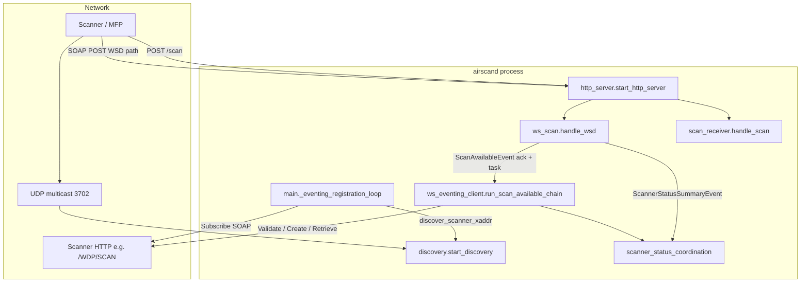

# Software architecture

This document describes how **airscand** is structured in the repository and how components interact at runtime. It is derived from the current Python sources (`main.py`, `app/`) and is meant to complement the product-oriented [design specification](design.md), which defines goals, phases, and protocol intent.

## System context

The daemon runs on a Linux host on the same LAN as the scanner. It:

- Answers **WS-Discovery** multicast traffic so the device can find the advertised SOAP endpoint.
- Serves **HTTP** (default port **5357**) for inbound SOAP on the WSD path and optional **push** scan uploads on `/scan`.
- Acts as a **WS-Eventing** client toward the scanner: subscribes for notifications, then drives the **WS-Scan** pull chain when a **ScanAvailableEvent** arrives at the sink.

The high-level pipeline in the design spec (discovery → HTTP SOAP → WS-Scan → storage) matches the implementation; outbound registration and the device-initiated **ValidateScanTicket → CreateScanJob → RetrieveImage** chain live primarily in `app/ws_eventing_client.py`.

## Runtime model

### Process and concurrency

`main.py` loads `Config`, calls `setup_logging`, then starts **three asyncio tasks** that run until shutdown:

| Task | Entry | Role |
|------|--------|------|
| Discovery | `app.discovery.start_discovery` | UDP **239.255.255.250:3702** listener; answers **Probe**/**Resolve**; sends periodic **Hello** and **Bye** on shutdown. |
| HTTP server | `app.http_server.start_http_server` | **aiohttp** `Application` bound to `WSD_HOST`/`WSD_PORT`; registers POST routes for SOAP and scan upload. |
| Eventing registration | `main._eventing_registration_loop` | Discovers scanner **XAddr**, optional preflight **Get**, **Subscribe** (and a second subscription for **ScannerStatusSummaryEvent**), retries with backoff until success. |

Signal **SIGINT** / **SIGTERM** trigger `_shutdown_services`: **Unsubscribe** for both subscriptions when IDs are known, then cancel the long-lived tasks. Discovery’s `finally` sends **Bye** before closing the socket.

### Shared configuration

The same `Config` instance is stored on the aiohttp app as `app["config"]` and is mutated at runtime (for example `scanner_xaddr`, WS-Eventing subscription IDs, destination tokens). Environment variables are read in `Config.__post_init__` in `app/config.py`.

## Logical architecture

## Package map

| Path | Responsibility |
|------|------------------|
| `main.py` | Orchestration: logging, three tasks, signal handling, WS-Eventing unsubscribe on exit. |
| `app/config.py` | `Config` dataclass: env-driven settings, persistent UUID and WS-Discovery sequence id under `XDG_STATE_HOME`. |
| `app/logging.py` | Root logger setup: JSON or human **AirscandConsoleFormatter** (DEBUG JSON, INFO+ human), optional wrap and inline context keys. |
| `app/discovery.py` | WS-Discovery XML builders, regex-based extraction, multicast loop, active `discover_scanner_xaddr` client probe, self-probe filtering. |
| `app/http_server.py` | Minimal aiohttp wiring: POST `endpoint_path` → `handle_wsd`, POST `scan_path` → `handle_scan`. |
| `app/ws_scan.py` | Inbound SOAP dispatch by `wsa:Action`: WS-Eventing sink responses, **CreateScanJob** response, **ScanAvailableEvent** ack + schedules `run_scan_available_chain`, **ScannerStatusSummaryEvent** → coordination. |
| `app/ws_eventing_client.py` | Outbound SOAP: **Subscribe**, **Unsubscribe**, **Get** (preflight), **GetScannerElements**, **ValidateScanTicket**, **CreateScanJob**, **GetJobStatus** polling, **RetrieveImage**; MTOM handling via `mtom`; scan ticket resolution; registration helpers. |
| `app/scan_receiver.py` | Push path: read body, delegate to `scan_storage.save_scan_file`. |
| `app/scan_storage.py` | Magic-byte and MIME-based extension selection, atomic write, shared by push and pull saves. |
| `app/mtom.py` | Multipart/related parsing and **xop:Include** CID resolution for **RetrieveImage** responses. |
| `app/scanner_status_coordination.py` | Single in-process `asyncio.Event` bridge: post-**RetrieveImage** wait for global **Idle** from **ScannerStatusSummaryEvent**. |
| `app/quirks/` | `ScannerProfile` registry (`get_profile`): vendor defaults (e.g. Epson WF-3640 timeouts and **GetJobStatus** disable). |

There is no separate `soap.py` module: SOAP is handled via string templates and regular expressions in `discovery.py`, `ws_scan.py`, and `ws_eventing_client.py`.

## Component details

### Discovery (`app/discovery.py`)

- Listens on **UDP 3702**, joins multicast group **239.255.255.250**, optional `IP_MULTICAST_IF` from `WSD_ADVERTISE_ADDR`.
- **Probe** → **ProbeMatches** with types including `wscn:ScanDeviceType` and **XAddr** `http://{advertise}:{port}{endpoint_path}`.
- **Resolve** when EPR matches `urn:uuid:{config.uuid}` → **ResolveMatches**.
- Outbound **Probe** (for `discover_scanner_xaddr`) uses a transient socket; outbound **MessageID**s are remembered to ignore reflected self-traffic.
- **Hello** at `WSD_HELLO_INTERVAL_SEC` with **AppSequence**; **Bye** on shutdown.

### HTTP server and routing (`app/http_server.py`)

- **POST** `WSD_ENDPOINT` (default `/wsd`): all inbound SOAP shown to the printer (WS-Eventing renewals toward the daemon, **CreateScanJob** if the device calls in, **ScanAvailableEvent**, **ScannerStatusSummaryEvent**, etc.).
- **POST** `WSD_SCAN_PATH` (default `/scan`): binary upload path for push delivery.

### WS-Scan handler (`app/ws_scan.py`)

- Extracts `wsa:Action` and treats the first **MessageID** in the envelope as the correlation id for responses (same pattern as early “string matching” approach in the design doc).
- **ScanAvailableEvent**: returns **ScanAvailableEventResponse** (`application/soap+xml`) immediately, then `asyncio.create_task(run_scan_available_chain(...))` with profile from `app.quirks.get_profile`, destination tokens from `Config`, and `output_dir` for pull saves.
- **ScannerStatusSummaryEvent**: parses state, calls `notify_scanner_state`, returns **ScannerStatusSummaryEventResponse**.

### Outbound scan chain (`app/ws_eventing_client.py`)

Implements the flow described in [design.md §6.2](design.md) (metadata probe, validate, create, retrieve):

1. **GetScannerElements** (best-effort): populates chain metadata; failures are logged, chain continues with template ticket from `resolve_scan_ticket_xml_for_chain`.
2. **ValidateScanTicket** to `{scanner_xaddr}`-derived **`/WDP/SCAN`** URL (`resolve_wdp_scan_url`).
3. **CreateScanJob** with resolved **DestinationToken** / **ScanIdentifier** (precedence documented in code: subscribe map, event body, validate response heuristics, subscription id). Optional retry without **DestinationToken** on `ClientErrorInvalidDestinationToken` when enabled in config.
4. **GetJobStatus** polling until ready or terminal failure (can be disabled per **ScannerProfile**, e.g. Epson WF-3640).
5. **RetrieveImage** via `_post_soap_retrieve_image` (long timeout); body parsed with `parse_retrieve_image_mtom`, image bytes passed to `save_scan_file` when `output_dir` is set.
6. Optional **Idle** wait: `begin_retrieve_idle_wait` / `await_scanner_idle_after_retrieve` / `end_retrieve_idle_wait` coordinated with inbound **ScannerStatusSummaryEvent** in `ws_scan`.

### WS-Eventing registration (`main.py` + `app/ws_eventing_client.py`)

- `_eventing_registration_loop` calls `discover_scanner_xaddr`, then optional `preflight_get_scanner_capabilities` (WS-Transfer **Get**) to refine **Subscribe** URL, then `register_with_scanner` for **ScanAvailableEvent** and again with `filter_action=SCANNER_STATUS_SUMMARY_EVENT_ACTION`.
- **NotifyTo** defaults to `http://{advertise_addr}:{port}{endpoint_path}` unless `WSD_EVENTING_NOTIFY_TO_URL` is set.
- **Unsubscribe** on shutdown uses subscription manager URLs and reference parameters from **SubscribeResponse** when present.

### Scan storage (`app/scan_storage.py`, `app/scan_receiver.py`)

- **detect_file_type**: JPEG (`FF D8`), PDF (`%PDF`), else `.bin`.
- **save_scan_file**: prefers MIME from `Content-Type` when mapping exists, else magic bytes; writes with **atomic replace** under `WSD_OUTPUT_DIR`.

### Vendor profiles (`app/quirks/`)

- **`ScannerProfile`**: `poll_get_job_status_before_retrieve`, `retrieve_image_timeout_sec`.
- **`epson_wf_3640`**: disables **GetJobStatus** polling before retrieve, extends retrieve timeout for chunked MTOM.

## Configuration surface

All settings are environment-driven; see `app/config.py` for the authoritative list. Notable groups:

- **HTTP bind**: `WSD_HOST`, `WSD_PORT`, `WSD_ENDPOINT`, `WSD_SCAN_PATH`, `WSD_OUTPUT_DIR`, `WSD_ADVERTISE_ADDR`.
- **Identity**: `WSD_UUID` (or state file), `WSD_APP_SEQUENCE_*`, `WSD_METADATA_VERSION`.
- **Discovery**: `WSD_HELLO_INTERVAL_SEC`, optional `WSD_SCANNER_XADDR` to skip discovery for registration.
- **Eventing / chain**: `WSD_SCANNER_SUBSCRIBE_TO_URL`, `WSD_EVENTING_NOTIFY_TO_URL`, `WSD_EVENTING_PREFLIGHT_GET`, destination token overrides, idle wait toggles, `WSD_SCANNER_PROFILE`, `WSD_RETRIEVE_IMAGE_TIMEOUT_SEC`.
- **Logging**: `WSD_LOG_LEVEL`, `WSD_LOG_JSON`, `WSD_LOG_WRAP`, `WSD_LOG_WRAP_WIDTH`.

## Observability

- **Structured fields**: Most paths log with `extra={...}` (SOAP leg, HTTP status, fault subcodes, job ids, paths).
- **Formats**: `JsonFormatter` for pure JSON mode; hybrid mode uses JSON for DEBUG and human lines for INFO+ with optional whitelisted inline keys (`LOG_INLINE_CONTEXT_KEYS`).

## Testing

- Tests live under `tests/`, pytest with `pytest-asyncio` for async code.
- Module tests align with components: `test_discovery`, `test_ws_scan`, `test_ws_eventing_client`, `test_scan_receiver`, `test_mtom`, `test_config`, `test_logging`, `test_quirks`, `test_scanner_status_coordination`, `test_main_registration`.

## Technology stack

- **Python** ≥ 3.11, **asyncio** concurrency.
- **aiohttp** for HTTP server and client.
- **coloredlogs** for optional ANSI human output.
- No separate XML stack: SOAP and discovery use string composition and regex extraction (consistent with design “Phase 1” style, with incremental complexity in `ws_eventing_client`).

## Deviations and notes relative to the design specification

- **Module naming**: Functionality described under `soap.py` in the design is folded into `ws_scan.py` and `ws_eventing_client.py`.
- **Dual WS-Eventing subscriptions**: The implementation registers a second subscription for **ScannerStatusSummaryEvent** to support idle coordination after **RetrieveImage**; the short design overview in §4 lists a single “WS-Scan Handler” box—operationally, inbound SOAP is still one HTTP handler (`handle_wsd`).
- **Push vs pull**: Both are implemented: `/scan` for push; pull uses **RetrieveImage** and shared `scan_storage`.

For protocol intent, phased roadmap, and risks, continue to use [design.md](design.md).
