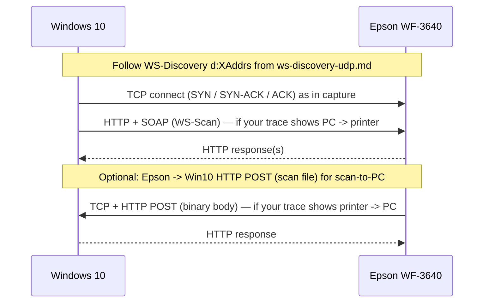

## WS-Scan (TCP/HTTP) - Capture Template (IPv4 only)

Use this file to paste the WS-Scan-related HTTP/TCP exchange from a capture between **Windows 10** and an **Epson WF-3640**.

**Project context:** `airscand` emulates the **Windows 10** side. Your reference capture is **Win10 ↔ real Epson**; the printer is the WS-Scan-capable device discovered via WS-Discovery. Paths and ports in the capture are the **Epson’s** (or Win10’s listener for “scan to computer”), not necessarily the defaults used when `airscand` runs on Linux.

### What to capture

- TCP connections between the Win10 host and the printer (addresses/ports from WS-Discovery `d:XAddrs` or your trace).
- HTTP **POST** (or other verbs if present) carrying **SOAP** for WS-Scan.
- Any **binary upload** of the scanned document (e.g. toward a “scan receiver” URL—direction depends on “scan to PC” vs “pull from scanner” in your workflow).

### Participants (assume IPv4 only)

| Role | Typical role in capture |
|------|-------------------------|
| Windows 10 | Client for SOAP to the scanner, and/or **listener** for inbound scan file upload (scan-to-computer). |
| Epson WF-3640 | HTTP server for device SOAP; may **POST** the scan to the PC when scanning to computer. |

### airscand repo (target behavior, for comparison)

When implementing the PC side, this repo intends to expose (configurable):

- `POST {WSD_ENDPOINT}` (default `/wsd`) — minimal SOAP response for bring-up.
- `POST {WSD_SCAN_PATH}` (default `/scan`) — receive uploaded scan bytes and save to disk.

Defaults: `WSD_PORT=5357`, `WSD_HOST=0.0.0.0`, `WSD_ADVERTISE_ADDR` for WS-Discovery advertisement when **this** machine is the discovered “scanner service” (reverse scenario vs Epson-led discovery).

**Use the capture** to record what **Epson and Win10 actually do**; align implementation later.

### Expected packet order (high level, capture-agnostic)

1. After WS-Discovery, endpoints follow advertised **`d:XAddrs`** (or equivalent).
2. One or more **TCP** connections; often **HTTP over TLS is not** used on LAN WSD in many setups—paste what you see (`http` vs `https`).
3. **SOAP** request/response pairs (actions vary by WS-Scan step).
4. **Scan payload** transfer (multipart or raw body) as your trace shows.

### Diagram (illustrative; adjust to your capture direction)

“Scan to computer” often has the **printer** open a connection **to** the PC for upload. “Pull” or driver-style flows may have **Win10** connect **to** the printer. Your paste sections should match **your** pcap.



### Paste Section: HTTP / SOAP (first significant exchange)

Paste full request (headers + body) and response.

**Request**

```xml
<!-- HTTP request (SOAP if applicable) -->
```

**Response**

```xml
<!-- HTTP response -->
```

### Paste Section: Additional SOAP round-trips (optional)

```xml
<!-- Additional HTTP/SOAP messages -->
```

### Paste Section: Scan file transfer (binary)

Paste headers; truncate body or note magic bytes (JPEG `FF D8`, PDF `%PDF`, etc.).

```http
<!-- Scan upload or download HTTP message -->
```

### Extracted fields (fill in manually)

- Client → server direction for each TCP flow: `__fill__`
- URL path(s): `__fill__`
- `Content-Type` / `SOAPAction` / SOAP `wsa:Action`: `__fill__`
- Scan payload format: `__fill__`

### Epson WS-Eventing note (WF-3640)

Observed behavior in bring-up:

- Win10 trace shows `Subscribe` to scanner WDP endpoint (`http://<scanner>:80/WDP/SCAN`) with matching `wsa:To`.
- Win10-shaped body includes `wse:EndTo` + `wse:NotifyTo` with `wsa:ReferenceParameters` / `wse:Identifier`, event filter for `.../ScanAvailableEvent`, and `sca:ScanDestinations`.
- Before `Subscribe`, Epson workflows may issue WS-Transfer `Get`; if `Get`/`Subscribe` are sent to the wrong role/path (for example `/WSD/DEVICE`), scanner can return `wsa:DestinationUnreachable`.
- Practical fallback can still retry alternate endpoints (for example `/WSDScanner`) when no better destination is learned from `Get`.
- Keep capture evidence for both requests and faults; this is useful to lock down model-specific defaults.

### WF-3640 scan available chain (current implementation)

When `airscand` receives `wsa:Action` `.../ScanAvailableEvent` on `/wsd`, it now performs:

1. Immediate generic HTTP `200 OK` response to the inbound event
2. Outbound `GetScannerElements` to scanner `http://<scanner>/WDP/SCAN` requesting:
   - `ScannerDescription`
   - `DefaultScanTicket`
   - `ScannerConfiguration`
   - `ScannerStatus`
3. Continue chain regardless of probe outcome (best-effort metadata enrichment)
4. Outbound `ValidateScanTicket` to scanner `http://<scanner>/WDP/SCAN`
5. Wait for `ValidateScanTicketResponse`
6. Outbound `CreateScanJob` to scanner `http://<scanner>/WDP/SCAN` only after successful validation

Notes:

- Initial `ValidateScanTicketRequest` payload is a fixed Win10-like template, not dynamically derived from event payload fields yet.
- Outbound scanner target is normalized to `/WDP/SCAN` from discovered/configured scanner endpoint.
- `GetScannerElements` results are currently captured for observability/logging and do not yet alter ticket/job request content.
